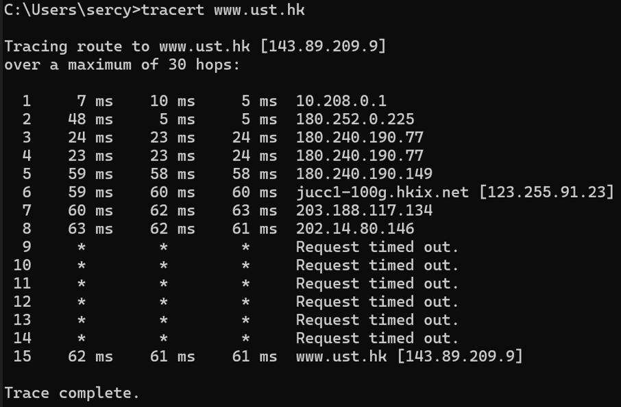
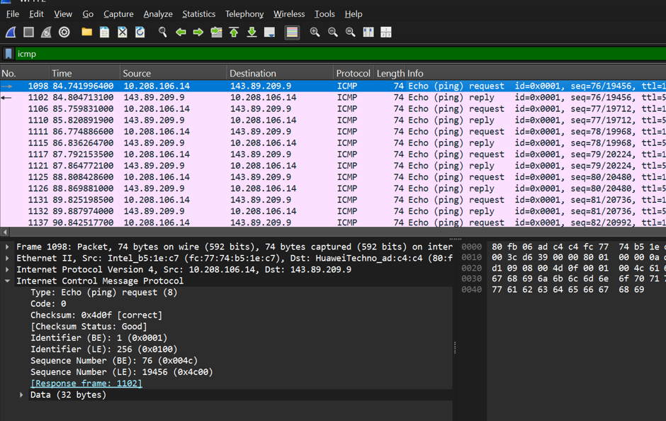
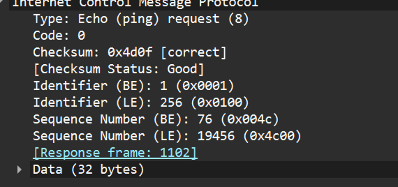
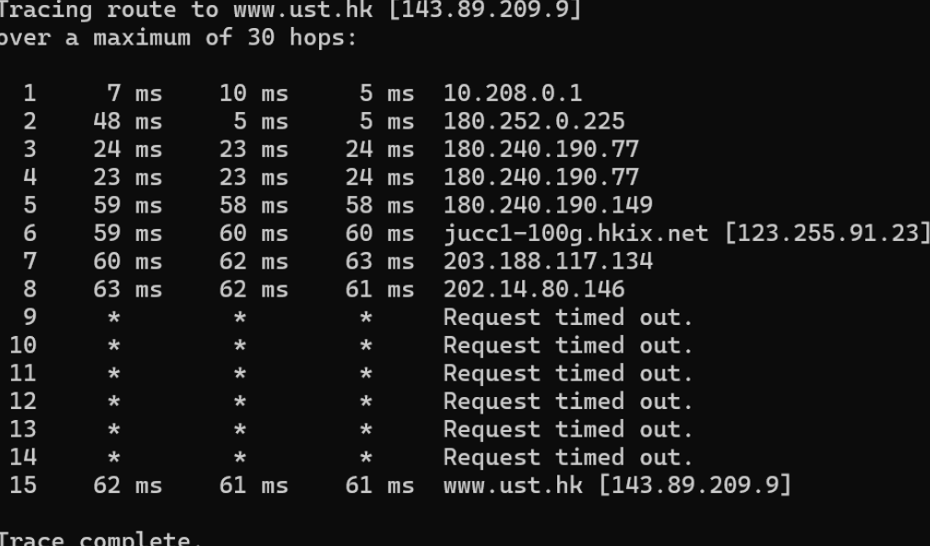
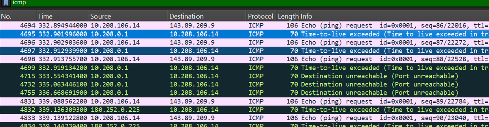
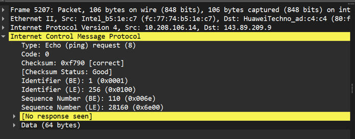
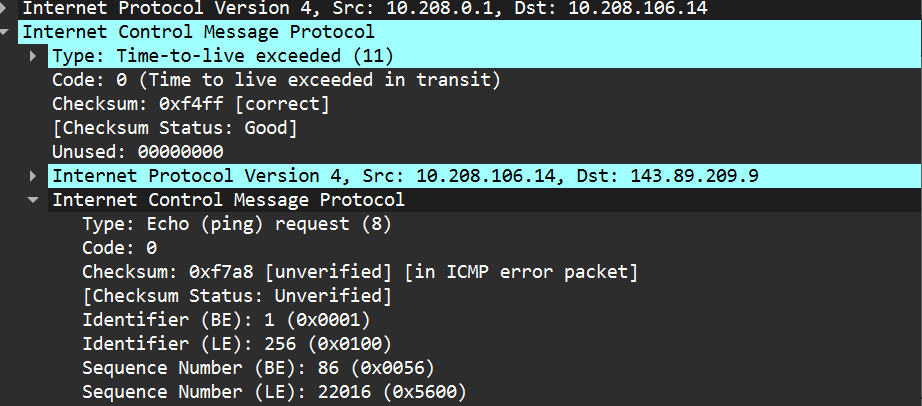

## Arya Bariq - 103072400132 - IF0405
# MODUL 12 : ICMP
## ICMP
ICMP (Internet Control Message Protocol) merupakan protokol pada jaringan komputer yang berfungsi untuk menyampaikan pesan kendali, memberikan informasi, serta melaporkan terjadinya kesalahan dalam proses komunikasi data berbasis IP.

**Fungsi ICMP**
1. Sebagai alat diagnostik jaringan untuk memastikan koneksi antar perangkat berjalan dengan normal.
2. Digunakan untuk memeriksa status jaringan dan memastikan host atau perangkat tujuan masih dapat diakses.

**ICMP digunakan untuk**
1. Memastikan host pada jaringan dapat merespons, misalnya melalui perintah ping untuk mengecek apakah perangkat sedang aktif.
2. Melacak jalur yang dilewati paket data dalam jaringan menggunakan traceroute atau tracert.
3. Mengirimkan pemberitahuan kesalahan apabila terjadi gangguan dalam proses pengiriman data, seperti alamat tujuan yang tidak bisa dicapai.

**Hubungan IP dengan ICMP**
ICMP bekerjasama dengan protokol IP dalam proses komunikasi jaringan. Ketika IP digunakan untuk mengirimkan paket data, ICMP memanfaatkan bagian payload pada paket IP untuk membawa pesan kontrol maupun laporan kesalahan. Dengan demikian, ICMP bukan pengganti IP, melainkan protokol pendukung yang membantu IP agar komunikasi jaringan dapat berjalan lebih baik.

**Isi paket ICMP**
1. Type : berfungsi untuk menunjukkan kategori atau jenis pesan yang dikirim oleh ICMP.
2. Code : memberikan keterangan lebih rinci mengenai tipe pesan ICMP tersebut.
3. Checksum : digunakan untuk memverifikasi apakah data paket mengalami kerusakan atau kesalahan saat dikirim.
4. Identifier : menjadi tanda pengenal agar paket ICMP dapat dibedakan satu sama lain.
5. Sequence Number : dipakai untuk menandai urutan paket yang dikirim dalam proses komunikasi.

## Analisis ICMP yang Dihasilkan Oleh Ping
1. Bukak wireshark dan pilih salah satu jaringan (Wifi), lalu aktifkan / capture
2. Buka CMD, kemudian ketikan perintah ping -n 10 www.ust.hk

3. Stop capture pada wireshark
4. Lakukan filter ICMP
5. Pilih dan expand salah satu paket ICMP Echo Request
6. Pilih dan expand salah satu paket ICMP Echo Reply

**Analisis**
- Pesan ICMP yang dihasilkan program Ping

Program ping menghasilkan dua jenis pesan ICMP, yaitu ICMP Echo Request dan ICMP Echo Reply. Berdasarkan hasil capture pada Wireshark di gambar tersebut, terlihat bahwa setiap paket request dari IP 192.168.100.83 ke 143.89.209.9 selalu diikuti oleh paket reply dari 143.89.209.9 kembali ke 192.168.100.83. Pada data yang ditampilkan terdapat 10 paket Echo Request dan 10 paket Echo Reply, sehingga total paket ICMP yang tercapture di Wireshark adalah 20 paket ICMP.
- Format dan Isi Pesan ICMP
1. ICMP Echo Request

- Type = 8 (Echo Request) → menunjukkan bahwa paket ICMP tersebut merupakan permintaan ping yang dikirim ke host tujuan.
- Code = 0 → menandakan tidak ada informasi kesalahan tambahan pada pesan ICMP tersebut.
- Checksum = 0x4d4c [correct] → menunjukkan checksum valid sehingga paket diterima tanpa kerusakan data.
- Identifier = 1 (0x0001) → digunakan sebagai identitas paket agar balasan Echo Reply dapat dicocokkan dengan request yang sesuai.
- Sequence Number = 15 (0x000f) → menandakan bahwa paket tersebut adalah paket ping urutan ke-15 yang dikirim.

2. ICMP Echo Reply

- Type = 0 (Echo Reply) → menandakan bahwa paket ICMP tersebut merupakan balasan ping dari host tujuan.
- Code = 0 → menunjukkan bahwa tidak ada informasi kesalahan tambahan pada paket balasan ICMP tersebut.
- Checksum = 0x554c [correct] → checksum dinyatakan valid sehingga paket reply diterima dengan baik tanpa kerusakan data.
- Identifier = 1 (0x0001) → digunakan sebagai penanda yang sama dengan paket request agar balasan dapat dikenali dan dicocokkan dengan permintaan sebelumnya.
- Sequence Number = 15 (0x000f) → menunjukkan bahwa paket reply tersebut merupakan balasan untuk paket request ping urutan ke-15.

## Analisis ICMP yang Dihasilkan Oleh Traceroute
1. Bukak wireshark dan pilih salah satu jaringan (Wifi), lalu aktifkan / capture
2. Buka CMD, kemudian ketikan perintah tracert www.ust.hk

3. Stop capture pada wireshark
4. Lakukan filter ICMP
5. Pilih dan expand salah satu paket ICMP Echo Request
6. Pilih dan expand salah satu paket Time To Live (TTL)

**Analisis**
- Pesan ICMP yang dihasilkan oleh program tracerout

1. ICMP Echo Request : jenis paket ICMP yang dipakai untuk meminta tanggapan dari host atau perangkat jaringan tujuan guna memastikan koneksi masih aktif.
2. ICMP Time Exceeded (TTL Expired) : pesan ICMP yang dikirim router ketika nilai TTL (Time To Live) pada paket telah habis sebelum paket berhasil mencapai alamat tujuan.
- Format dan Isi Pesan ICMP
1. ICMP Echo Request

- Type = 8 (Echo Request) → menandakan bahwa paket ICMP tersebut merupakan permintaan ping yang dikirim ke host tujuan.
- Code = 0 → menunjukkan bahwa tidak ada informasi tambahan maupun error pada paket ICMP tersebut.
- Checksum = 0xf7e5 [correct] → checksum dinyatakan valid sehingga paket berhasil dikirim tanpa mengalami kerusakan data.
- Identifier = 1 (0x0001) → digunakan sebagai identitas atau penanda paket request agar dapat dikenali saat menerima balasan.
- Sequence Number = 25 (0x0019) → menunjukkan bahwa paket tersebut merupakan paket ping urutan ke-25 yang dikirim.
2. ICMP Time Exceeded

- Type = 11 (Time Exceeded) → menunjukkan bahwa paket ICMP tersebut merupakan pesan Time Exceeded akibat nilai TTL habis sebelum mencapai tujuan.
- Code = 0 → menandakan kondisi TTL exceeded in transit, yaitu TTL paket habis selama proses perjalanan di jaringan.
- Checksum = 0xf4ff [correct] → menunjukkan bahwa paket diterima dengan baik tanpa mengalami kerusakan data.
- Source IP = 192.168.100.1 → merupakan alamat router yang mengirimkan pesan Time Exceeded.
- Destination IP = 192.168.100.83 → merupakan host pengirim paket ping atau traceroute yang menerima pesan tersebut.